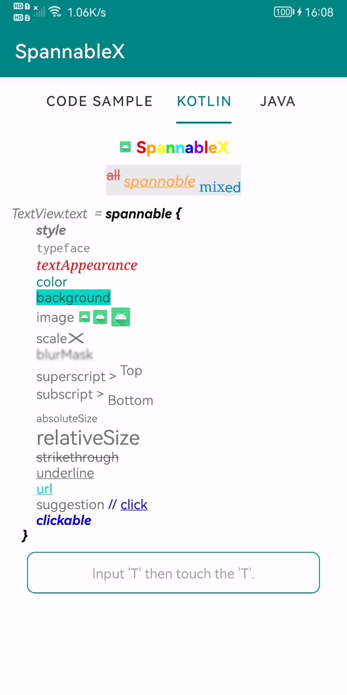

|             Code Sample              |            Kotlin            |            Java            |
| :----------------------------------: | :--------------------------: | -------------------------- |
|  |  |  |


## 集成

框架存储在 ***mavenCentral*** ，大部分情况不需要手动配置，添加远程仓库根据创建项目的 Android Studio 版本有所不同。

``` groovy
// 项目根目录build.gradle
allprojects {
    repositories {
        mavenCentral()
        maven { url 'https://jitpack.io' }
    }
}
```

``` groovy
// 项目根目录settings.gradle
dependencyResolutionManagement {
    repositories {
        mavenCentral()
        maven { url 'https://jitpack.io' }
    }
}
```

然后在 module 的 build.gradle 添加依赖框架

``` groovy
dependencies {
    // https://github.com/TxcA/SpannableX
    implementation 'com.itxca.spannablex:spannablex:1.0.3'

    // 若需使用glide()方法加载网络图片或Gif, 需同时引入Glide
    implementation com.github.bumptech.glide:glide:4.13.1
}
```


## 使用

- **[Kotlin DSL](https://txca.github.io/SpannableX/dsl/)**

  ``` kotlin
  TextView.text = spannable {
                    "this is real text.".text()
                    "spannable".color(Color.BLUE).style(Typeface.BOLD)
                  }
  ```

- **[Kotlin|Java 链式](https://txca.github.io/SpannableX/chain/)**

  ``` java
  TextView.setText(Span.create()
                    .text("this is real text.")
                    .text("spannable").color(Color.BLUE).style(Typeface.BOLD)
                    .spannable());
  ```
