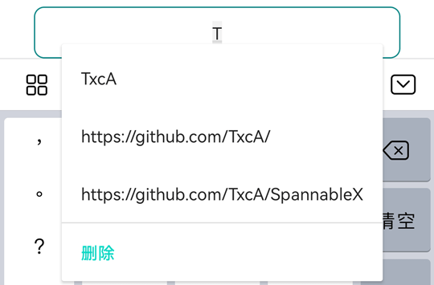
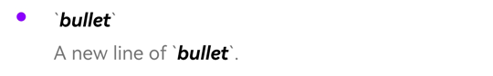

为了方便使用，***SpannableX*** 里二次封装了系统的常用Span。

这些方法在 *[Kotlin DSL](https://txca.github.io/SpannableX/dsl/)* 及 *[Kotlin\Java 链式](https://txca.github.io/SpannableX/chain/)* 调用里，使用了同样的方法名及参数。

## 常用Span示例

```kotlin
TextView.text = spannable {
	"bold red text.".span {
        // 参见下方`完整Span说明`的style方法
		style(Typeface.BOLD)
        
        // 参见下方`完整Span说明`的color方法
		color(Color.RED)
	}
}
```


## 完整Span说明

所有的`CharacterStyle`方法，都带有 ***replaceRule*** 替换规则参数，对于替换规则详解，请查看 **[替换规则](https://txca.github.io/SpannableX/replace/)** 说明。
对于内置的`ParagraphStyle`，由于是对段落进行操作，都不支持***replaceRule*** 替换规则参数。

这里只列出方法名及效果说明，详细参数说明可查看**[ API文档 ](https://txca.github.io/SpannableX/api/)**或查看**[ Sample ](https://github.com/TxcA/SpannableX/blob/master/app/src/main/java/com/itxca/sample/spannable/KotlinFragment.kt)**。

| 方法             | 效果说明                   | 对应Span                         | 效果示例                 |
| ---------------- | ------------------------- | ------------------------------- |----------------------- |
| style()          | 设置文本样式               | StyleSpan                       ||
| typeface()       | 设置字体样式               | TypefaceSpan                    ||
| textAppearance() | 设置字体效果               | TextAppearanceSpan              ||
| color()          | 文本颜色                   | ForegroundColorSpan             ||
| background()     | 背景颜色                   | BackgroundColorSpan             ||
| image()          | 图片                       | CenterImageSpan                ||
| glide()          | Glide加载图片              | GlideImageSpan                  ||
| scaleX()         | X轴文本缩放                | ScaleXSpan                      ||
| maskFilter()     | 文本蒙版效果               | MaskFilterSpan                  ||
| blurMask()       | 文本模糊滤镜蒙版效果        | BlurMaskFilter                  ||
| superscript()    | 文本上标                   | SuperscriptSpan                 ||
| subscript()      | 文本下标                   | SubscriptSpan                   ||
| absoluteSize()   | 文本绝对大小               | AbsoluteSizeSpan                ||
| relativeSize()   | 文本相对大小               | RelativeSizeSpan                ||
| strikethrough()  | 删除线                    | StrikethroughSpan               ||
| underline()      | 下划线                    | UnderlineSpan                   ||
| url()            | 超链接                    | URLSpan                         ||
| suggestion()     | 文本输入提示               | SuggestionSpan                  ||
| clickable()      | 可点击文本                 | SimpleClickableSpan             ||
| margin()         | 文本间距                  | MarginSpan                      ||
| quote()          | 段落引用样式(段落前竖线标识) | QuoteSpan<br>LegacyQuoteSpan    ||
| bullet()         | 段落项目符号(段落前圆形标识) | BulletSpan<br>LegacyBulletSpan  ||
| alignment()      | 段落对齐方式                | AlignmentSpan.Standard         ||
| lineBackground() | 段落背景颜色                | LineBackgroundSpan.Standard<br>LegacyLineBackgroundSpan      ||
| leadingMargin()  | 段落文本缩进                | LeadingMarginSpan              ||
| lineHeight()     | 段落行高                   | LineHeightSpan.Standard<br>LegacyLineHeightSpan              ||
| imageParagraph() | 段落图片                   | ParagraphBitmapSpan<br>ParagraphDrawableSpan                 ||

## 使用自定义Span
对于未内置的`Span`或自定义的`Span`，可以使用`custom`方法快速集成及使用`CharacterStyle`&`ParagraphStyle`.
- **kotlin**
  ``` kotlin
  TextView.text = spannable {
                   "       custom".custom(ForegroundColorSpan(Color.RED))
                  }
  ```

- **java**
  ``` java
  TextView.setText(Span.create()
                    .text("       .custom()").custom(new ForegroundColorSpan(Color.RED))
                    .spannable());
  ```

## 其它说明

**👉 本地、网络、Gif图片加载:** [图片加载](https://txca.github.io/SpannableX/image/)

**👉 替换规则(DSL、链式通用):** [替换规则](https://txca.github.io/SpannableX/replace/)